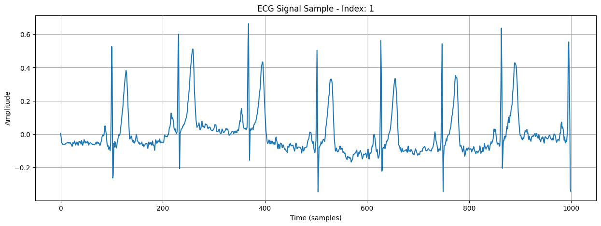
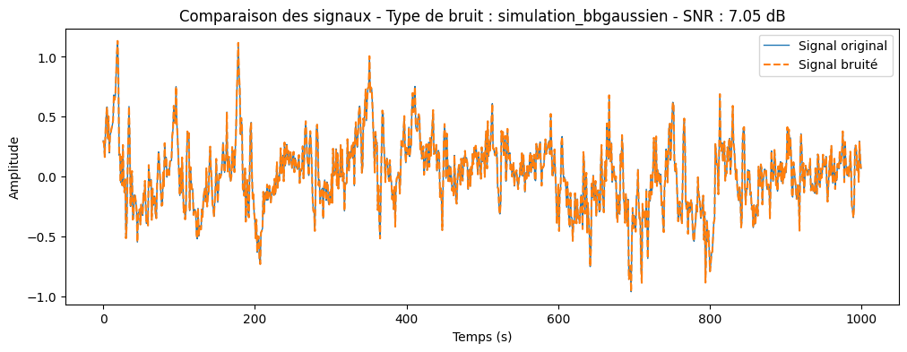
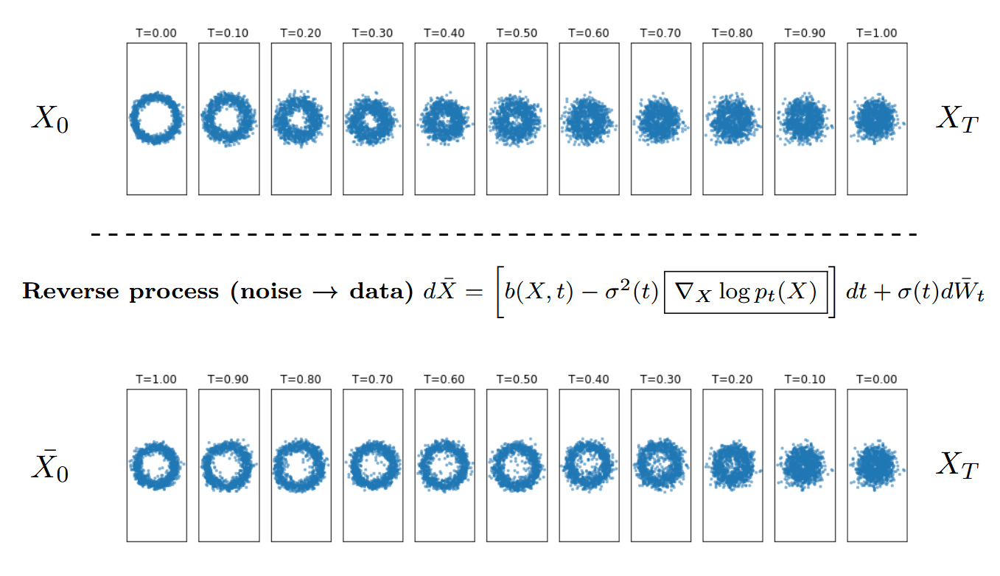
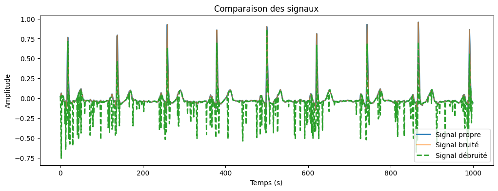

**Débruitage des Signaux ECG par Modèle de Diffusion**

## 1. Introduction

- **Objectif** : Entraîner un modèle à reconstruire un signal ECG propre à partir d'un signal bruité
- **Approches explorées** :
  - Modèle de diffusion

## 2. État de l'Art sur les Types de Bruit dans les ECGs
- **Bruit Gaussien blanc** : Bruit de fond aléatoire
- **Bruit de baseline** : Variation lente due à la respiration
- **Mouvement d'électrode** : Artefacts causés par le mouvement du patient
- **Artefacts musculaires** : Interférences des activités musculaires sur l'ECG
- **Interférence électrique** : Bruits causés par le réseau électrique ($50Hz$)

## 3. Description des Données
- **Source des données** : Base de données ECG publique,accessible [ici](https://physionet.org/content/ptb-xl/1.0.3/)

**Composition de la base de données** :

    - Nombre total d'enregistrements : 21 801 ECGs cliniques de 10 secondes chacun.​

    - Nombre de patients : 18 869 individus uniques.​

    - Nombre de canaux : 12 canaux

Annotations et métadonnées :

    - Chaque enregistrement est annoté par un ou deux cardiologues, avec un total de 71 déclarations ECG différentes conformes à la norme ""SCP-ECG"".

    - Les enregistrements sont accompagnés de métadonnées telles que l'âge, le sexe, et des informations cliniques supplémentaires.

- **Division des ensembles** :
  - 80% pour l'entraînement
  - 10% pour la validation
  - 10% pour le test

## 4. Ajout de Bruit et Quantification (SNR)
- **Méthode d'ajout de bruit** :
  - Une proportion aléatoire des signaux ECG est bruitée (50%)
  - Différents types de bruit sont appliqués de manière aléatoire à chaque signal
  - Chaque canal du signal reçoit un bruit avec un SNR différent (entre 6 dB et 24 dB)
  - L'information sur le type de bruit et le SNR est enregistrée pour analyse ultérieure
- **Illustration graphique des signaux bruités** :
  - Comparaison d'un signal propre vs bruité

Les dépots cités pour le bruitage  en référence s'inspire de Muldrow et al. 1984.

## 5. Conception du Modèle de Diffusion
- **Principe** :
  - Le modèle apprend à inverser le processus de dégradation progressive du signal ECG bruité
  - La diffusion ajoute du bruit de manière contrôlée, et l'entraînement consiste à inverser ce bruit
  

- **Architecture** :
  - Réseau U-Net modifié pour gérer les séries temporelles (Ho et al. 2020)
  - Apprentissage conditionné sur le niveau de bruit initial pour une meilleure reconstruction
On vous renvoie vers le projet annuel du M2 Data Science sur ces modèles([ici](https://github.com/mahamat9/diffusion_model_M2DSUA/blob/main/rapport/TER_Diffusion_Model.pdf) et [Test sur MNIST](https://github.com/mahamat9/diffusion_model_M2DSUA/tree/main/tibo%20-%20Mod%C3%A8les%20%C3%A0%20Difusion)), pour plus des explications théoriques.

Courbe des pertes pendant l'entrainement

## 6. Résultats et Analyses
- **Impact du niveau de bruit (SNR) sur la reconstruction**
- **Métriques d'évaluation** :
  - **MSE** (Mean Squared Error)
  - SNR résultant après débruitage
  - Corrélation entre signal reconstruit et signal propre
- **Visualisation des signaux originaux/entrée(bruité)/sortie(debruité) du modèle**

### Résultats quantitatifs sur les données test:
| Métrique                  | Valeur                  |
|---------------------------|-------------------------|
| **MSE**                   | 0.08           |
| **SNR(post débruitage)** | -1.72 dB          |
| **Coefficient de corrélation** | 0.79 |

## 7. Pistes d'améliorations
- Tenir compte du niveau du SNR et du type de bruit dans la fonction de perte
- Explorer d'autres architectures(DAE, GAN...) ou intégrer un "time embedding" pour capturer plus efficacement les dynamiques temporelles du signal.

- Prise en compte des propriétés physiologiques du signal ECG dans la fonction de perte(cela nécessite des connaissances plus approfondies)
- **Utilisation de techniques semi-supervisées pour s'adapter à de nouveaux types de bruit**

## 8. Conclusion
**Synthèse** :
    Le projet présente une approche novatrice de débruitage des signaux ECG en utilisant un modèle de diffusion, qui apprend à inverser un processus de dégradation progressive. 
    L'intégration de différents types de bruit (gaussien, baseline, mouvement d'électrode, artefacts musculaires et interférence électrique) permet de simuler des conditions réelles et d'évaluer de manière fine la robustesse du modèle.

**Apports** :
Une architecture de modèle U-Net modifié adaptée aux séries temporelles($X_t$), spécialement conçue pour les signaux ECG.

Un ensemble complet de métriques (MSE, SNR, corrélation) permettant une évaluation de la qualité du débruitage.

**Limites**
- **Complexité Computationnelle** : Temps d'entraînement important et ressources GPU élevées.
- **Généralisation limitée** : Besoin de validation sur d'autres bases de données ECG.
- **Manque d'Intégration Physiologique** : Absence de prise en compte des contraintes cliniques spécifiques aux ECG.

## Sources

* Modèle de diffusion génération, Mémoire M2 Data Science à l'UA, mars 2025 [Rapport](https://github.com/mahamat9/diffusion_model_M2DSUA/blob/main/rapport/TER_Diffusion_Model.pdf) [Test sur MNIST](https://github.com/mahamat9/diffusion_model_M2DSUA/tree/main/tibo%20-%20Mod%C3%A8les%20%C3%A0%20Difusion)

* [MichWozPol ECG_denoising repot](https://github.com/MichWozPol/ECG_denoising/blob/main/DeepLearningMethods/DeepLearningMethodsNotebook.ipynb)

* DeScoD-ECG: Deep Score-Based Diffusion Model
for ECG Baseline Wander and Noise Removal [lien](https://arxiv.org/pdf/2208.00542)

* DeepFilter: An ECG baseline wander removal filter using deep learning techniques [lien](https://www.sciencedirect.com/science/article/pii/S1746809421005899#sec2)

* ECG signal enhancement based on improved denoising auto-encoder [lien](https://www.sciencedirect.com/science/article/abs/pii/S0952197616300331)